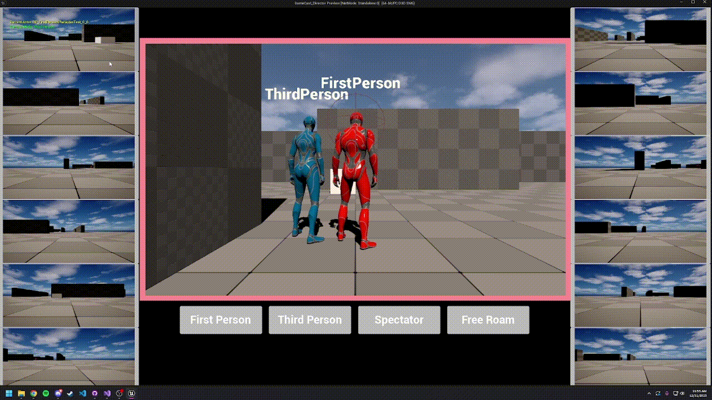
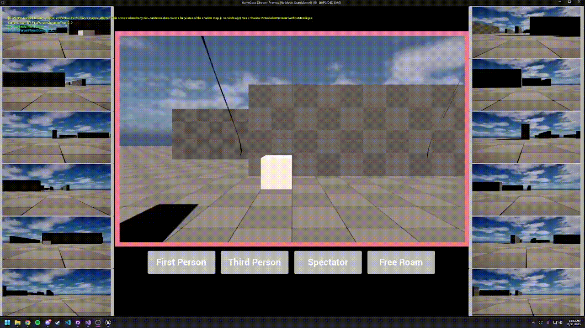

# Game Cast Director — Unreal Engine Plugin

The Game Cast Director plugin will act as a director, providing users with the ability to switch camera controls between different perspectives. The ability to also move around freely in space will be useful to provide cinematic shots as well as capture the action moments.

## Overview

The Game Cast Director plugin adds a custom spectator system that lets you freely move, orbit, or follow any player in the game.

This is useful for:

- Multiplayer games  
- ESports production
- Streaming or recording gameplay  
- Getting cinematic shots

---

## Features

- Multiple camera modes  
  - Spectator  
  - First Person
  - Free roam
  - Third Person  

- Player cycling  
  - Switch between players using input or UI  

- Blueprint-friendly API  
  - Switch targets  
  - Change camera modes  

---

## Requirements

- Unreal Engine 5.4 – 5.6

